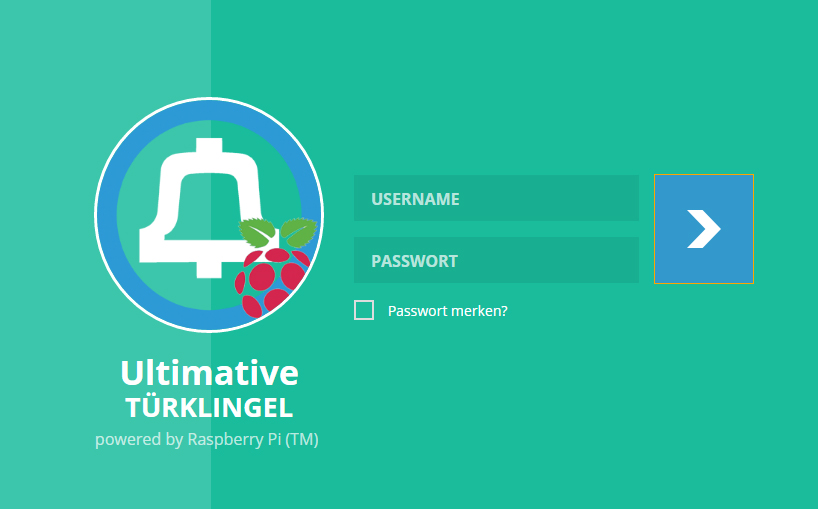
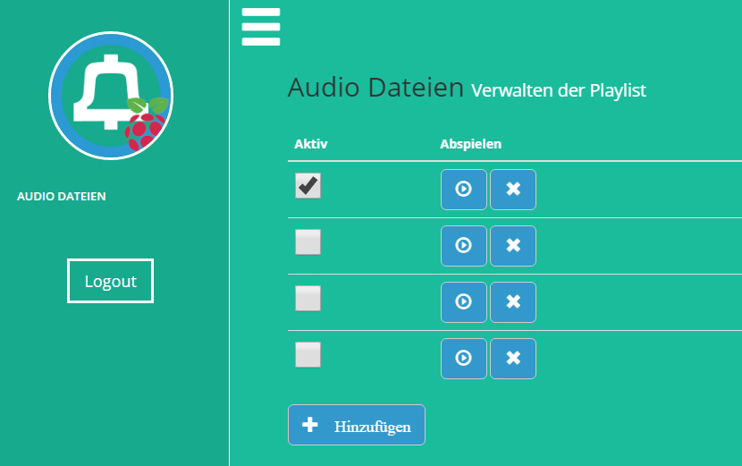

# PiGong
Java webapplication to be run on a raspberry pi that can act as an door gong playing mp3 sounds.
The application provides a webinteface to switch and upload custom mp3 files.

# Prequesites
* Raspberry Pi with installed java and configured ethernet or wireless access
* MySQL Database
* Speaker
* Button/switch

# Screenshots

# Copyright & License

(c) Christian Drescher, 2016.

[Apache Public License 2.0](http://www.apache.org/licenses/LICENSE-2.0.html)

